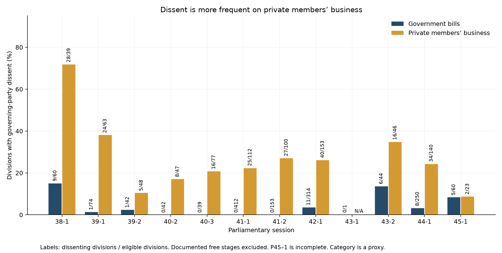

# Party Partisanship

A reproducible study of party cohesion and dissent in the Canadian House of Commons, conducted for curiosity and exploration.

The frozen corpus covers recorded divisions in sessions **38-1 through 45-1**. The original exports are preserved. Documented repairs reconstruct two incomplete records and recover dual-coded votes from official XML. Analysis runs offline, checks every division, and generates its findings from the same tables used for the charts.

## What the results show

The main E1 comparison finds governing-party dissent on **41 of 1,491 government-bill divisions (2.75%)**, versus **225 of 848 private-members-business divisions (26.53%)**. This is a descriptive ratio of **9.65**, after excluding documented free-vote stages for the governing party. Different classification assumptions give different ratios; they are reported together in the [sensitivity table](experiments/results_e1/sensitivity.csv).

This is evidence about voting patterns by business category. It does not identify the causal effect of a whip instruction. Party policy, issues, participation, caucus size, and repeated votes on a bill also matter.



E7 compares aggregate metrics with values computed from Godbout and Høyland’s deposited raw voting matrices for Parliaments 38–40. **36 of 36 comparisons match to two decimals**, and the maximum difference is **0.00 percentage points**. Shared definitions make this a data-agreement check, not an independent validation of the arithmetic or whip classifier. [Full E7 findings](experiments/results_e7/FINDINGS_E7.md)

## Reproduce the results

Use **Python 3.12** in a fresh virtual environment. The dependency lock includes exact transitive versions.

```text
python -m venv .venv
```

Windows PowerShell:

```powershell
.\.venv\Scripts\python.exe -m pip install -r requirements-lock.txt
.\.venv\Scripts\python.exe reproduce.py --check --repeat
```

macOS or Linux:

```sh
.venv/bin/python -m pip install -r requirements-lock.txt
.venv/bin/python reproduce.py --check --repeat
```

Dependency installation needs network access. Reproduction does not. The command verifies the frozen inputs, rebuilds the source repairs, runs regression tests, validates the corpus, checks the benchmark reconstruction, runs both experiments twice, and compares the numerical tables and findings with the saved outputs. It records the environment and hashes in [the run manifest](audit/run_manifest.json).

Read [REPRODUCING.md](REPRODUCING.md) for the data contract, commands, output schemas, limitations, and update procedure.

## Read the work

| Document | Purpose |
| --- | --- |
| [Implementation audit](audit/IMPLEMENTATION_AUDIT.md) | Changes against the reviewed baseline, evidence, tests, and remaining uncertainty |
| [E1 findings](experiments/results_e1/FINDINGS_E1.md) | Dissent by category, scope sensitivity, and interpretation |
| [E7 findings](experiments/results_e7/FINDINGS_E7.md) | Benchmark agreement, metric definitions, and limits |
| [Data decisions](audit/DATA_DECISIONS.md) | Why each source repair is necessary and how it is reproduced |
| [Classification sources](audit/CLASSIFICATION_AUDIT.md) | Verified free-vote scope and unresolved historical questions |

## Repository map

```text
Parliament_<P>-<S>/          Original member CSVs and division metadata
House of Commons/           Original LEGISinfo XML bill archive
experiments/experiment_7_data/  Deposited comparison matrices and codebook
vote_data.py                Strict parsing and explicit source repairs
bill_info.py                Business classification and sourced party/stage status
check_data.py               Integrity gate with no blanket tally tolerance
visualize_parliament.py     Cohesion, dissent, loyalty, and legacy plotting helpers
experiments/                E1, E7, benchmark builder, and generated results
reproduce.py                Offline reproduction and repeatability audit
audit/                      Decisions, hashes, test evidence, and reports
evidence/                   Frozen official XML, Journals, and historical sources
tests/                      Hand-calculated and failure-path regression fixtures
tools/                      Explicit evidence retrieval and audit reconstruction
```

## Research boundaries

- Party dissent means a binary vote against the observed caucus majority. It is not automatically defiance of a whip. Tied caucus divisions have no majority and are omitted from dissent and loyalty calculations.
- Official dual-coded votes count on both sides when checking announced tallies. They are excluded from binary metrics. Paired votes are also excluded.
- C-38 and C-14 free-vote records are party- and stage-specific. Liberal backbench freedom does not imply cabinet freedom. Caucus-level exclusions do not measure backbencher-only behavior.
- C-30, C-17, some later-stage scope, and the malformed subject in 42-1 division 247 remain explicit uncertainties. They are not silently classified as verified whipped votes.
- Session 40-1 is omitted from E1 because it has one division; E7 includes it when pooling Parliament 40. The 45-1 snapshot is incomplete and is not a live feed.
- The two experiments use different contested-division filters: E1 uses a 95% majority-share threshold; E7 requires more than five binary votes on each side. Their definitions are retained and documented separately.

## Next research

E1 and E7 have been implemented and audited. E2—trends over time—remains next. E3–E6 cover government status, concentration of dissent across MPs, confidence-related business, and voting stages. These analyses are not included in this repair and reproducibility update.

## Sources

The [House of Commons vote exports](https://www.ourcommons.ca/members/en/votes), [Journals](https://www.ourcommons.ca/DocumentViewer/en/house/latest/journals), and [LEGISinfo](https://www.parl.ca/legisinfo/en/overview) provide the parliamentary records. The comparison deposit is Godbout and Høyland’s *Canadian Parliament Voting Data, 1867–2015*; the included Parliaments 38–40 subset and its [codebook](experiments/experiment_7_data/readme.txt) are retained for offline reproduction. Benchmark values are computed from those matrices, not transcribed from published figures.

## Verification work

The [collection and legacy review](audit/COLLECTION_AND_LEGACY_REVIEW.md) records the next engineering pass, including separate raw collection snapshots, stable MP identifiers, deterministic diagnostics, and cross-platform CI. It also identifies the source and record-level checks that remain open.

The [record-level reconciliation and bill-refresh review](audit/RECONCILIATION_REVIEW.md) extends verification beyond aggregate scores and documents a current export schema change and loss of historical sponsor fields.

The [later-session and bill-coverage review](audit/SOURCE_COVERAGE_REVIEW.md) adds a fixed XML sample and session-wide bill checks. A reviewed 45-1 bill supplement improves classification provenance without changing the results.
