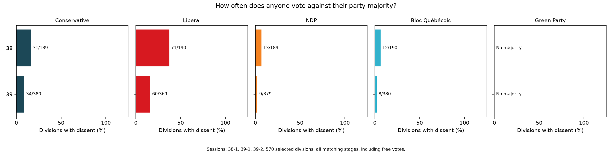

# Party-Partisanship

Explore party unity and dissent in Canada's House of Commons: one bill, several bills, types of business, or whole parliaments.

The data contains **4,851 recorded divisions** across sessions 38-1 through 45-1. The 45-1 snapshot is incomplete. A dissenting vote means voting against the observed party majority. It can prompt questions about whipping or conscience, but does not by itself establish an MP's instructions or motives.

## Preliminary analysis



This comparison includes all recorded business in Parliaments 38 and 39. Labels show divisions with dissent / divisions with a defined party majority. It describes voting patterns; differences in topics, participation and free-vote opportunities also matter.

## Get started

Use Python 3.12:

```sh
python -m venv .venv
# Windows PowerShell: .venv\Scripts\Activate.ps1
# macOS/Linux: source .venv/bin/activate
python -m pip install -r requirements.txt
python analyze.py --parliament 38 39 --output outputs/compare
```

That command reproduces the preliminary analysis. Each run validates the data and writes CSV tables, a compressed member-vote CSV, a chart and a manifest into a new output directory.

## Explore

```sh
# One complete bill, including its recorded stages
python analyze.py --session 42-1 --bill 42-1/C-89 --group-by bill --output outputs/postal

# Compare several bills (bill numbers restart each session)
python analyze.py --bill 42-1/C-89 42-1/C-14 --group-by bill --output outputs/bills

# Compare business categories within a session
python analyze.py --session 44-1 --group-by category --output outputs/categories

# Compare a bill type across two parliaments
python analyze.py --parliament 38 39 --bill-type "House Government Bill" --output outputs/government

# Search bill titles and vote subjects; any keyword matches
python analyze.py --keyword climate environment --group-by bill --output outputs/topics

# Export all data and summarize by session
python analyze.py --group-by session --output outputs/all
```

Keywords are case-insensitive substring matches against long titles and division subjects, not full bill text. Different filters combine with AND. Parliament selections pool all their sessions. Grouping by bill excludes unnumbered business from the summary. Inspect `divisions.csv` to see exactly which votes matched.

## Read the results

- **Dissent frequency:** divisions with any minority vote / divisions with a defined party majority.
- **Dissent intensity:** minority member-votes / member-votes in those majority-defined divisions.
- **Rice cohesion:** average `100 × abs(Yea − Nay) / (Yea + Nay)`; 100 means unanimity and 0 an even split.

Frequency and mean Rice weight divisions equally, so bills with more votes contribute more. Paired and dual-coded votes are excluded from binary measures. Ties are excluded from dissent but enter Rice as zero; no-vote observations are omitted. Independents are retained in the data but not treated as one caucus. All matching stages are included, whether whipped or free.

[Data columns, joins and reuse examples](DATA.md). Original source files remain in `Parliament_<P>-<S>/` and `House of Commons/`. Small, source-backed corrections are applied at load time from `data/corrections/`; supporting official records are compressed in `data/sources/`.

## Collect and check

```sh
python can_scrape.py --session 43-1 --output incoming/43-1-new
python check_data.py
python -m unittest discover -s tests -q
python tools/check_export.py outputs/all
```

Collection creates a separate snapshot, checks every tally, and rechecks the session listing before reporting success. Review new snapshots before replacing included data. Two live downloads of 43-1 returned identical data for all 26 divisions; this does not establish live retrieval of every historical session.

Sources: [House votes](https://www.ourcommons.ca/members/en/votes), [LEGISinfo](https://www.parl.ca/legisinfo/en/overview), and official Journals referenced in the correction records. Cite the sources, repository commit and selection when sharing results. The original plotting helpers remain in `visualize_parliament.py`; use `analyze.py --bill` to select whole bills rather than individual division files.
